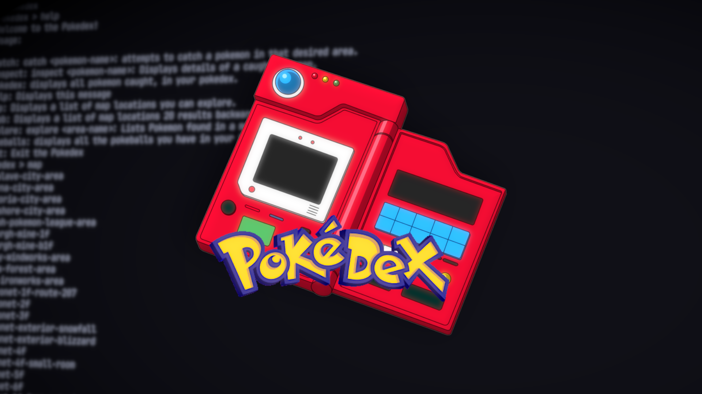

# Pokedex

An interactive command-line Pokedex built in Go that uses HTTP requests to fetch Pokemon and location data from PokeAPI. Explore locations, catch Pokemon with different Pokeball types, manage your ball inventory, and grow your collection. An in-memory cache reduces redundant API requests and speeds up repeated commands.



## Installation

Requires Go. Install it @ [go.dev](https://go.dev/doc/install).

```sh
go install github.com/andrefetch/pokedex@latest
pokedex
```

### Install from source

```sh
git clone https://github.com/andrefetch/pokedex.git
cd pokedex
go build -o pokedex .
./pokedex
```

## Usage & Quick Start

1. Run `pokedex` in your terminal.
2. You should see the `Pokedex > ` prompt.
3. Enter `help` to display all available commands.
4. Use `map` to browse locations and `explore <area-name>` to discover Pokemon.
5. Use `catch <pokemon-name> <ball-type>` to attempt a catch.

### Example

Enter these commands at the Pokedex prompt, replacing the placeholders with a location and Pokemon you find:

```text
map
explore <area-name>
catch <pokemon-name> pokeball
inspect <pokemon-name>
pokedex
```

Each catch attempt consumes a ball, whether it succeeds or fails. Use `inspect` after a successful catch to view the Pokemon’s details.

Supported ball types: `pokeball`, `greatball`, `ultraball`, and `masterball`. You must have the selected ball in your inventory to use it.

Your ball inventory and caught Pokemon are stored in memory and reset when you exit. 

> [!NOTE]
> Working on a persistent storage system, so your Pokemon and Pokeballs don't disappear. 

## Roadmap

- [x] Multiple Pokeball types and inventory
- [ ] Simulated battles and parties
- [ ] Persistent ball inventory and caught Pokemon across sessions
- [ ] Pokemon evolution
- [ ] Additional unit tests
